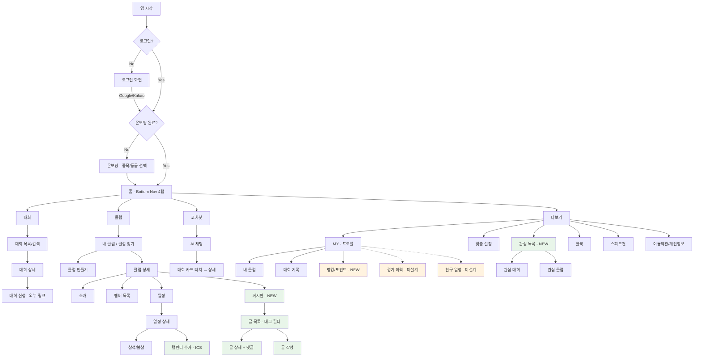
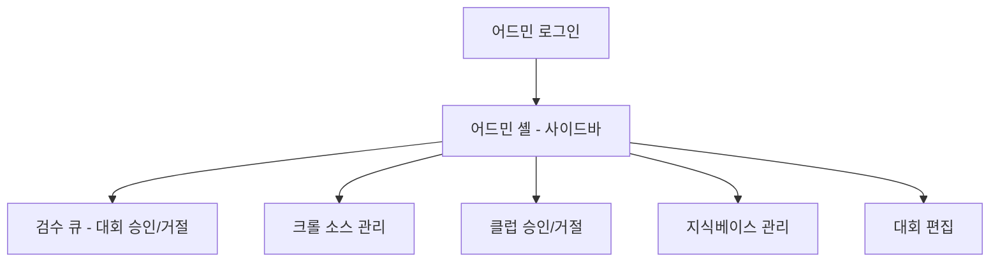

# Match-up 앱 화면 구조 (App Map)

> VS Code에서 `Cmd+Shift+V`로 미리보기.

## 사용자 앱 (모바일)

```mermaid
graph TD
    Launch[앱 시작] --> AuthCheck{로그인?}
    AuthCheck -->|No| Login[로그인 화면]
    AuthCheck -->|Yes| HasOnboarding{온보딩 완료?}

    Login -->|Google/Kakao| HasOnboarding
    HasOnboarding -->|No| Onboarding[온보딩 - 종목/등급 선택]
    HasOnboarding -->|Yes| Home

    Onboarding --> Home[홈 - Bottom Nav 4탭]

    Home --> Tab1[대회]
    Home --> Tab2[클럽]
    Home --> Tab3[코치봇]
    Home --> Tab4[더보기]

    %% 대회 탭
    Tab1 --> TournamentList[대회 목록/검색]
    TournamentList --> TournamentDetail[대회 상세]
    TournamentDetail --> TournamentApply[대회 신청 - 외부 링크]

    %% 클럽 탭
    Tab2 --> ClubTabs[내 클럽 / 클럽 찾기]
    ClubTabs --> ClubCreate[클럽 만들기]
    ClubTabs --> ClubDetail[클럽 상세]

    ClubDetail --> ClubInfo[소개]
    ClubDetail --> ClubMembers[멤버 목록]
    ClubDetail --> ClubEvents[일정]
    ClubDetail --> ClubPosts[게시판 - NEW]

    ClubEvents --> EventDetail[일정 상세]
    EventDetail --> EventAttend[참석/불참]
    EventDetail --> EventICS[캘린더 추가 - ICS]

    ClubPosts --> PostList[글 목록 - 태그 필터]
    PostList --> PostDetail[글 상세 + 댓글]
    PostList --> PostWrite[글 작성]

    %% 코치봇 탭
    Tab3 --> ChatScreen[AI 채팅]
    ChatScreen --> ChatCards[대회 카드 터치 → 상세]

    %% 더보기 탭
    Tab4 --> Profile[MY - 프로필]
    Tab4 --> Settings[맞춤 설정]
    Tab4 --> Favorites[관심 목록 - NEW]
    Tab4 --> Rules[룰북]
    Tab4 --> SpeedGun[스피드건]
    Tab4 --> Legal[이용약관/개인정보]

    Profile --> MyClubs[내 클럽]
    Profile --> MyRecords[대회 기록]
    Profile --> MyRanking[랭킹/포인트 - NEW]

    Favorites --> FavTournaments[관심 대회]
    Favorites --> FavClubs[관심 클럽]

    %% 미설계 (점선)
    Profile -.-> MatchHistory[경기 이력 - 미설계]
    Profile -.-> FriendSchedule[친구 일정 - 미설계]

    style ClubPosts fill:#e8f5e9
    style PostList fill:#e8f5e9
    style PostDetail fill:#e8f5e9
    style PostWrite fill:#e8f5e9
    style MyRanking fill:#fff3e0
    style MatchHistory fill:#fff3e0
    style FriendSchedule fill:#fff3e0
    style Favorites fill:#e8f5e9
    style EventICS fill:#e8f5e9
```

## 범례

- 초록 배경: 이번 설계에 포함 (NEW)
- 주황 배경: 미설계 (경기 이력/랭킹/친구 일정)
- 흰 배경: 기존 구현 완료

## 어드민 웹

```mermaid
graph TD
    AdminLogin[어드민 로그인] --> AdminShell[어드민 셸 - 사이드바]

    AdminShell --> AdminDrafts[검수 큐 - 대회 승인/거절]
    AdminShell --> AdminSources[크롤 소스 관리]
    AdminShell --> AdminClubs[클럽 승인/거절]
    AdminShell --> AdminKB[지식베이스 관리]
    AdminShell --> AdminTournaments[대회 편집]
```
